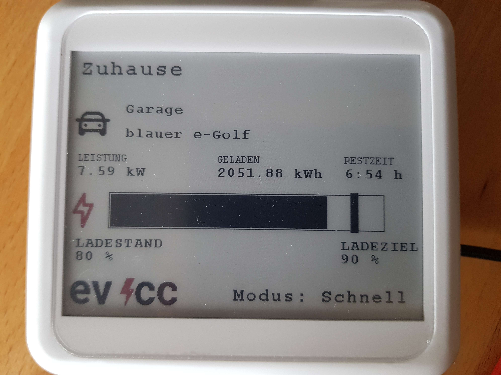

# EVCC E-Ink Monitor
A ESP8266 based IoT Device as a EVCC status monitor.

## About
The aim of this project is to use the EVCC Rest-API to realize a basic Monitor to show the actual status on a low power E-Ink Display.

The software was primarily developed and tested for the Waveshare E-Ink Display 400x300, 4.2inch E-Ink raw display, three-color. The ESP8266 controller will frequently aquire the status of the evcc server and Update the Display to visualize the actual status.

## Features
1. Easy to setup Config Menü, thanks to IoTWebConf
2. Statuspage for quick functional checks
3. Accesspoint for inital setup (via phone, computer)
4. Clear Display if no car is connected
5. Fast Display Update if Setting change have been detected
6. Default 15min Display Update

## Images

## Knows Issues / Limitations
1. No Fallback strategy if Admin password is lost
2. No Support for multiple Loadpoints
3. No Input capabilities, display only
4. i unfortunately had to rewrite large parts of the waveshare software to get non-blocking code, so the code examples are no longer compatible with other displays.

## Acknowledgements

### Third party libraries
* [IotWebConf](https://github.com/prampec/IotWebConf)
* [ArduinoJson](https://github.com/bblanchon/ArduinoJson)
* [Waveshare](https://www.waveshare.com/wiki/4.2inch_e-Paper_Module_(B)#Run_the_Program)
